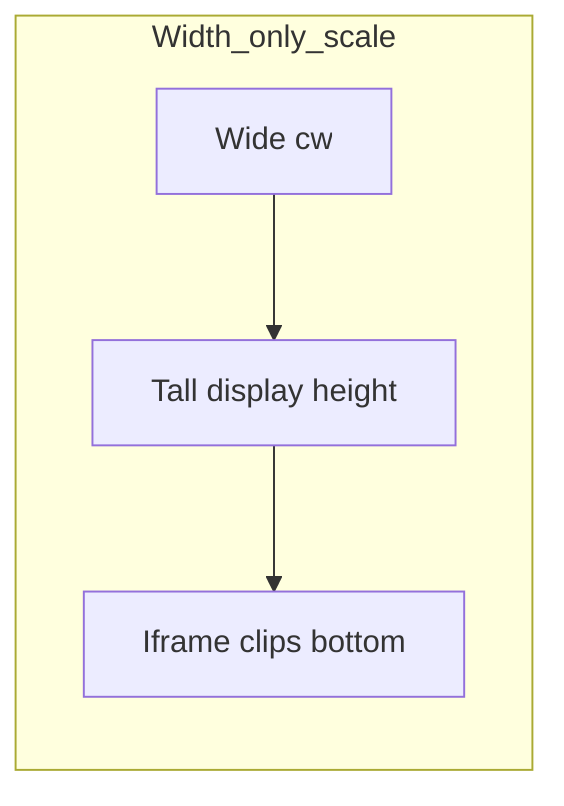

# Fix canvas fit + dual-layout Relax/Dino tests

## Problem

[`minigames/dino/dino.js`](c:\Users\padma\OneDrive\Documents\Projects-Darwin\flow-assist\minigames\dino\dino.js) `resize()` uses **`scale = cw / W`** only. When the host iframe is wide, **`H * scale` exceeds the iframe’s visible height** (host still caps height via [`.relax-game-frame-wrap`](c:\Users\padma\OneDrive\Documents\Projects-Darwin\flow-assist\styles.css) / iframe `max-height`). With **`overflow: hidden`** on the iframe document ([`dino.css`](c:\Users\padma\OneDrive\Documents\Projects-Darwin\flow-assist\minigames\dino\dino.css)), the **bottom of the canvas (ground + player) is clipped**, which reads as “zoomed in” / missing gameplay.

## 1. Fix scaling: letterbox fit inside the iframe viewport

**File:** [`minigames/dino/dino.js`](c:\Users\padma\OneDrive\Documents\Projects-Darwin\flow-assist\minigames\dino\dino.js)

In `resize()`:

- Keep **`cw`** from `.dino-canvas-wrap`’s `clientWidth` (or fallback `W`).
- Compute **`maxCanvasCssHeight`**: usable vertical space for the canvas region inside the iframe. Prefer **`window.innerHeight`** minus **measured** reserved chrome:
  - `#dino-root` vertical padding (from `getComputedStyle` or small fixed slack),
  - `.dino-hud` `offsetHeight` + margins,
  - `#dino-hint` and `#dino-overlay-msg` when visible (use `offsetHeight`; overlay may be hidden—still reserve min line height if needed).
- **`scale = Math.min(cw / W, maxCanvasCssHeight / H)`** with a sensible floor (e.g. `scale >= 0.25`) so tiny windows don’t break.
- Set `canvas.style.width` / `height` from **`W * scale`** and **`H * scale`** as today.

Optional follow-up in **`dino.css`**: make `#dino-root` / `.dino-canvas-wrap` participate in flex with **`min-height: 0`** so future layout is less ambiguous (only if needed after the JS fix).

Call **`resize()`** once on **`requestAnimationFrame`** after first paint if needed so `innerHeight` / HUD heights are stable (only if first frame measures wrong).

## 2. Electron test helpers: compact vs maximized window

**File:** [`tests/helpers/electron-app.js`](c:\Users\padma\OneDrive\Documents\Projects-Darwin\flow-assist\tests\helpers\electron-app.js)

Add exported helpers (names can be adjusted):

- **`setMainWindowCompact(app)`** — main process `BrowserWindow`: **`unmaximize()`**, then **`setBounds`** with fixed dimensions (e.g. **960×640** or **1024×700**) centered or default position so Relax layout is “small app” and reproducible.
- **`setMainWindowMaximized(app)`** — **`maximize()`** on the main BrowserWindow (`getFocusedWindow()` or first window from `getAllWindows()`).

Implementation via **`ElectronApplication.evaluate`** passing Electron’s **`BrowserWindow`** (same pattern as Playwright’s Electron docs: code runs in the main-process context supplied by Playwright).

These keep **`launchFlowAssist`** unchanged; tests call one helper **after** launch / **before** navigating.

## 3. Run Desert Run regression tests in both layouts

**File:** [`tests/regression/relax-dino.spec.js`](c:\Users\padma\OneDrive\Documents\Projects-Darwin\flow-assist\tests/regression/relax-dino.spec.js)

- Introduce a small matrix: **`['compact', 'maximized']`** (or `test.describe.each`).
- For **each** layout: **`launchFlowAssist()` → apply layout helper → existing flow** (`waitForProfileLoaded`, Relax, expand panel, iframe/canvas steps).
- Keep assertions the same; optionally assert **`scale`-related sanity** only if cheap (e.g. iframe bounding box height &gt; 0)—not required if gameplay tests already pass.

Do **not** duplicate the entire [`relax-view.spec.js`](c:\Users\padma\OneDrive\Documents\Projects-Darwin\flow-assist\tests/regression/relax-view.spec.js) suite twice unless you explicitly want it; the request targets Desert Run behavior under window size—scope **`relax-dino.spec.js`** first.

## 4. Verification

- Manual: wide Relax + expanded Desert Run — **full scene visible**, player on ground.
- **`npm run test:regression`** (or at least `tests/regression/relax-dino.spec.js`) — all scenarios pass for **both** layouts.

## Scope

- No changes to [`main.js`](c:\Users\padma\OneDrive\Documents\Projects-Darwin\flow-assist\main.js) default window size unless compact helper proves unreliable (prefer test-only bounds).
