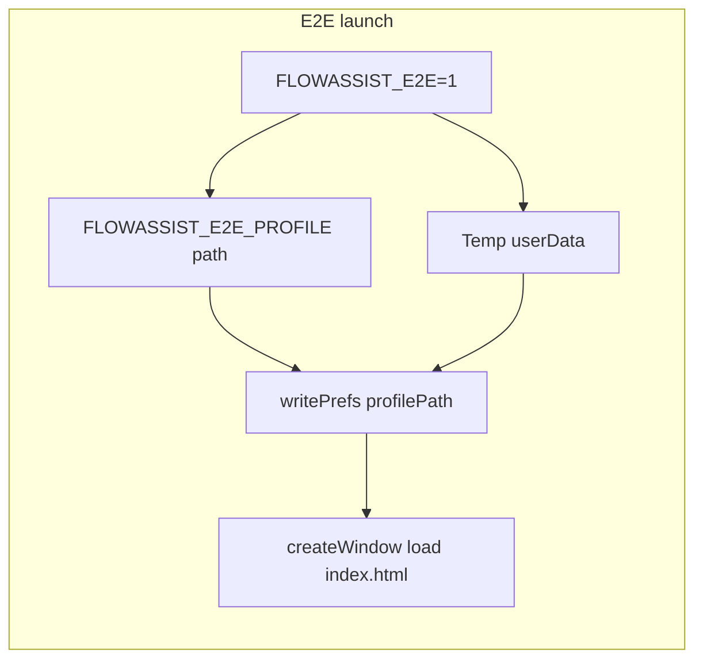

# Phased Playwright regression suite (FlowAssist)

## Scope and reality check

- **“Line-by-line” of `renderer.js`**: The file is very large (~8k+ lines). A useful plan is **feature-sliced** inventory driven by [`index.html`](c:\Users\padma\OneDrive\Documents\Projects-Darwin\flow-assist\index.html) (stable IDs), [`preload.js`](c:\Users\padma\OneDrive\Documents\Projects-Darwin\flow-assist\preload.js) (`taskAPI` surface), and [`main.js`](c:\Users\padma\OneDrive\Documents\Projects-Darwin\flow-assist\main.js) (IPC + profile rules), plus **git history** (already informative: list filters, notifications, archive, notes, summary export, calendar day-offs, etc.).
- **“All prompts across all agents/models”**: Cursor stores a **subset** of transcripts under the project’s `agent-transcripts` folder (currently 5 JSONL files). They are helpful for *recent* context (e.g. Playwright setup) but are **not a guaranteed complete archive** of every past chat. The plan treats **git commits + code + your requirements** as the source of truth, and uses transcripts only as supplemental context.

## Golden dataset (your choice: committed fixture)

- Add **[`tests/fixtures/padmakarr-testing-2.fa.json`](c:\Users\padma\OneDrive\Documents\Projects-Darwin\flow-assist\tests\fixtures\padmakarr-testing-2.fa.json)** by copying your existing `c:\Users\padma\OneDrive\Documents\Projects-Darwin\padmakarr-testing-2.fa.json` into the repo (scrub secrets if any; keep structure/tasks representative).
- **Mutation safety**: For specs that save tasks, point the app at a **per-run copy** of the fixture (e.g. under `test-results/` or `os.tmpdir()`), set `profilePath` to that copy via prefs, so the committed fixture stays immutable. Read-only specs can load the fixture path directly.

## Required product hook (small, E2E-only)

Today, `FLOWASSIST_E2E=1` uses a temp `userData` with **empty prefs**, so [`load-tasks`](c:\Users\padma\OneDrive\Documents\Projects-Darwin\flow-assist\main.js) falls back to legacy [`tasks.json`](c:\Users\padma\OneDrive\Documents\Projects-Darwin\flow-assist\tasks.json) unless a profile is set.

- Extend [`main.js`](c:\Users\padma\OneDrive\Documents\Projects-Darwin\flow-assist\main.js) so that when `FLOWASSIST_E2E=1` **and** `FLOWASSIST_E2E_PROFILE` is set to an absolute or repo-relative path, **before** `createWindow()` (inside `app.whenReady` early, after `userData` is fixed), call existing `writePrefs({ profilePath: normalizedAbsolutePath })` (or equivalent) so the renderer’s first `loadTasks()` hits your golden file (or the per-run copy path passed in env).
- Document in [`tests/README.md`](c:\Users\padma\OneDrive\Documents\Projects-Darwin\flow-assist\tests\README.md): default `FLOWASSIST_E2E_PROFILE` points at `tests/fixtures/padmakarr-testing-2.fa.json` via path resolved from repo root in [`tests/helpers/electron-app.js`](c:\Users\padma\OneDrive\Documents\Projects-Darwin\flow-assist\tests\helpers\electron-app.js).

## Playwright structure (grow by phase)

Keep existing layout; add **spec files per area** under [`tests/regression/`](c:\Users\padma\OneDrive\Documents\Projects-Darwin\flow-assist\tests\regression) and shared helpers under [`tests/helpers/`](c:\Users\padma\OneDrive\Documents\Projects-Darwin\flow-assist\tests\helpers):

| Phase | New spec files (proposed) | What they cover (from HTML + IPC + git themes) |
|-------|---------------------------|--------------------------------------------------|
| **0 – Fixture + launch** | Extend `electron-app.js`; optional `profile-copy.js` | Launch with golden profile; optional `beforeEach` copy for mutating tests |
| **1 – App shell** | `navigation.spec.js`, `top-bar-menus.spec.js` | Sidebar `data-view` buttons, `#top-bar-view-btn` nested menu (screen + sidebar width), `#top-bar-sidebar-toggle`, `#sidebar-rail-toggle`, `#notif-bell-btn` open/close / empty state |
| **2 – List view** | `list-view-tasks.spec.js`, `list-filters-sort.spec.js` | `#task-list`, `#add-new-task-btn` / `#add-new-task-block`, `#task-title`, `#add-task-btn`, empty validation, `#main-task-filter-btn` / `#main-task-filter-menu`, `#completed-task-list`, archive-related UI if present in DOM |
| **3 – Calendar** | `calendar-view.spec.js` | `#view-calendar`, `#calendar-prev-btn` / `#calendar-next-btn`, `#calendar-goto-date`, `#calendar-filter`, `#calendar-dayoff-toggle` panel, day-off add flow |
| **4 – Summary** | `summary-view.spec.js` | Summary date range controls (IDs in HTML tail), export paths that avoid native dialogs where possible; `#export-options-modal` if triggered from UI |
| **5 – Notes** | `notes-view.spec.js`, `notes-modal.spec.js` | Notes list vs modal `#notes-modal`, filters mentioned in git (“created-date filter”), reminder UI surfaces |
| **6 – Relax** | `relax-view.spec.js` | `#view-relax` / relax controls; timers may need `page.clock` or reduced assertions if time-dependent |
| **7 – Settings** | Extend existing or `settings-modal.spec.js` | Theme `#setting-theme`, save/cancel, persistence checks via reload + `taskAPI` not needed if UI reflects; priority colors optional |
| **8 – Profiles / file menu** | `profiles-ipc.spec.js` (optional) | Native **Open/Save** dialogs are awkward in Playwright; prefer **renderer-invoked** `profileActivateFromPath` via `page.evaluate(() => window.taskAPI.profileActivateFromPath(...))` for “load profile” behavior without OS dialog, aligned with [`preload.js`](c:\Users\padma\OneDrive\Documents\Projects-Darwin\flow-assist\preload.js) |
| **9 – Visual** | `visual-smoke.spec.js` + `expect(page).toHaveScreenshot()` | Baselines under e.g. `tests/regression/__screenshots__/` or Playwright default; limit to stable views (list shell, settings dialog) to avoid flaky full-page shots |

## Execution rhythm (“over and over in smaller chunks”)

After you approve implementation:

1. Land **Phase 0** (fixture file + `FLOWASSIST_E2E_PROFILE` + helper + docs) and ensure `npm run test:regression` still green.
2. Land **Phase 1** specs; run `npm run test:regression`; fix selectors.
3. Repeat **Phase 2–9** as separate PR-sized chunks; each chunk should add specs + run regression + update UI map snapshots only when structure changes.

## What you will do once (manual, minimal)

- One-time **copy** `padmakarr-testing-2.fa.json` into `tests/fixtures/` (and strip anything sensitive).
- After intentional UI changes: refresh snapshots (`npm run test:ui-map`) and/or screenshot baselines as per [`.cursorrules`](c:\Users\padma\OneDrive\Documents\Projects-Darwin\flow-assist\.cursorrules).

## Out of scope (unless you ask later)

- True **native file picker** automation (generally brittle on Windows); prefer IPC `profileActivateFromPath` from `page.evaluate` or dedicated test-only IPC (only if needed).
- Full **property-based** or **fuzz** testing (could be a later layer).
