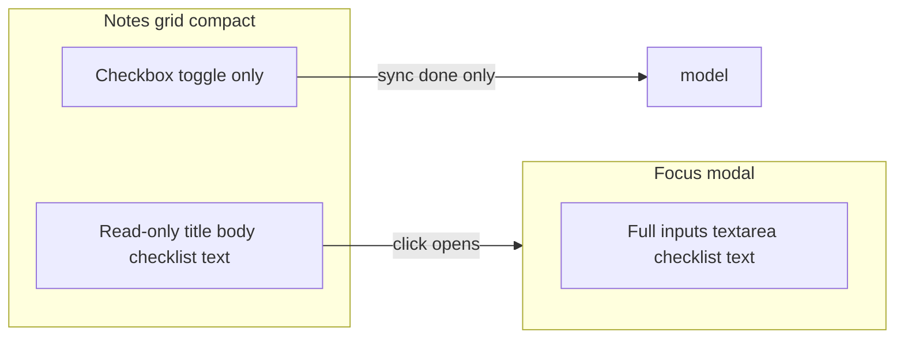

# Notes grid fill-size, read-only grid, wider modal, slim scrollbar

## Context (current behavior)

- Notes live under [`index.html`](c:\Users\padma\OneDrive\Documents\Projects-Darwin\flow-assist\index.html) inside `#view-notes` with toolbar + `#notes-board`.
- [`styles.css`](c:\Users\padma\OneDrive\Documents\Projects-Darwin\flow-assist\styles.css) constrains `#view-notes` with `max-width: min(100%, 1680px)` and horizontal padding; `.notes-modal-content` caps width at ~600px ([~2724–2735](c:\Users\padma\OneDrive\Documents\Projects-Darwin\flow-assist\styles.css)).
- [`renderer.js`](c:\Users\padma\OneDrive\Documents\Projects-Darwin\flow-assist\renderer.js) `renderNoteCardHtml` builds **editable** inputs for compact grid cards and uses `openNotesModal` from board clicks while excluding `input, textarea, button, label` ([~1831–1850](c:\Users\padma\OneDrive\Documents\Projects-Darwin\flow-assist\renderer.js)) — which blocks opening when interacting with checklist rows wrapped in `<label>`.

## 1. Notes grid: full width/height of main content, resize-friendly

**Goal:** Toolbar stays top; the board consumes remaining vertical space and uses full width of the main column (no centered max-width column).

**CSS changes** (target `#view-notes` and `.notes-board`):

- Remove `max-width` / horizontal centering on `#view-notes`; keep modest horizontal padding if desired (or edge-to-edge per preference—default: small consistent padding).
- Make `#view-notes` a column flex child that participates in the existing `.content-body > .view-panel.active` flex layout (`flex: 1`, `min-height: 0`, `width: 100%`).
- Make `.notes-toolbar` `flex-shrink: 0`.
- Make `.notes-board` grow (`flex: 1`, `min-height: 0`) with **`overflow: visible`** so scrolling stays on `.view-panel.active` (already `overflow-y: auto` in [~797–803](c:\Users\padma\OneDrive\Documents\Projects-Darwin\flow-assist\styles.css)). That keeps a **single vertical scrollbar** along the right edge of the main content area when the notes list is tall—matching “scrollbar at the right edge of the app window” for the document shell (sidebar stays left).

**Optional refinement:** If internal scroll is ever added to `#notes-board`, it would introduce a second scrollbar—avoid unless requested.

## 2. Focus modal: larger, wider, dynamic; hide “Note” / “To-do list” label

**[`index.html`](c:\Users\padma\OneDrive\Documents\Projects-Darwin\flow-assist\index.html)**  
- Keep `#notes-modal-title` for accessibility but hide visually (e.g. `class="visually-hidden"` / `sr-only`) **or** drop visible heading and set `aria-label` on the dialog — prefer one accessible name without visible “Note” / “To-do list” text.

**[`renderer.js`](c:\Users\padma\OneDrive\Documents\Projects-Darwin\flow-assist\renderer.js)**  
- Stop updating `#notes-modal-title` text in `renderNotesModal` if the title is sr-only with a fixed phrase like “Note editor”, or remove `getElementById('notes-modal-title')` usage if switching to `aria-label` only.

**[`styles.css`](c:\Users\padma\OneDrive\Documents\Projects-Darwin\flow-assist\styles.css)**  
- Increase `.notes-modal-content` width using viewport-based `min()`/`clamp()` (e.g. aim ~**880–960px** max at large widths, ~**92–96vw** cap with margins).
- Increase `max-height` slightly (e.g. **~88–90vh**) so the focused editor feels bigger and scales with window size.
- Optionally bump padding/typography under `.notes-card--modal` / `.notes-modal-body` for readability.

## 3. Grid read-only; editing only in focus mode (except checkbox)

**Rendering (`renderNoteCardHtml`, [`renderer.js`](c:\Users\padma\OneDrive\Documents\Projects-Darwin\flow-assist\renderer.js)):**

- Introduce a clear rule: **`readonlyPreview = compact && !isModal`** (grid vs modal).
- **Notes:** replace grid `<input class="notes-card-title">` / `<textarea class="notes-card-body">` with non-editable elements (e.g. `
`, `
`) showing escaped title/body; use `white-space: pre-wrap` for body.
- **Todos:** for readonly rows, keep `<input type="checkbox" class="notes-todo-done">` but **remove the wrapping `<label>` that covers the whole row** (it interferes with “click text to focus”). Use a compact label **only** around the checkbox or associate via `id`/`for`, plus a **non-input** element for line text (e.g. ``).
- **Remove** the **Add item** button from compact/grid rendering only; keep it in modal/full editor (`compact: false`) so new checklist lines are added only in focus mode.

**Sync (`syncNoteCardToModel`):**

- For todos, continue syncing **checkbox → `done`** from grid rows via `data-item-id`.
- Skip syncing todo **text** from the grid when the row has no `.notes-todo-text` input (display span only).

**Events (`bindNotesEventsOnce` click handler):**

- Replace blanket exclusion `input, textarea, button, label` with finer rules:
  - Always ignore **delete** (already first).
  - Ignore **`input.notes-todo-done`** (and optional checkbox label) so toggling does not open the modal.
  - Ignore other **`button`** clicks except already-handled delete/add (add absent on grid).
  - Clicks on readonly title/body/checklist text → **`openNotesModal(noteId)`**.

**[`renderNotes`](c:\Users\padma\OneDrive\Documents\Projects-Darwin\flow-assist\renderer.js):**  
- Remove `autoResizeTextarea` for grid when note cards no longer use textarea (keep it for modal path only).

**CSS:** Add styles for `.notes-card-title-display`, `.notes-card-body-display`, `.notes-todo-text-display` (ellipsis optional; wrapping allowed per earlier checklist styles).

## 4. Slimmer scrollbar at the content edge

**[`styles.css`](c:\Users\padma\OneDrive\Documents\Projects-Darwin\flow-assist\styles.css)** global block ([~5302–5310](c:\Users\padma\OneDrive\Documents\Projects-Darwin\flow-assist\styles.css)):

- Reduce `::-webkit-scrollbar` **width/height** from **8px** to **4px** (or 5px if 4 feels too thin).
- Keep `scrollbar-width: thin` for Firefox (already set); optionally document that WebKit gets explicit px control.

This affects all scrollable surfaces consistently (same as today’s global rule).

## 5. Verification

- Resize window: notes toolbar + grid use full main column; modal width/height track viewport.
- Grid: cannot type in title/body/todo text; checkbox toggles persist; clicking text opens modal.
- Modal: full editing including Add item; title headers not visually showing “Note” / “To-do list”.
- Scrollbar visibly thinner; long notes list scrolls with scrollbar along the main content’s right edge (no stray inner scrollbar on `#notes-board` unless intentionally added).

## Files to touch

| File | Changes |
|------|---------|
| [`styles.css`](c:\Users\padma\OneDrive\Documents\Projects-Darwin\flow-assist\styles.css) | `#view-notes` / `.notes-board` flex + full width; modal wider/taller; readonly display styles; scrollbar dimensions |
| [`renderer.js`](c:\Users\padma\OneDrive\Documents\Projects-Darwin\flow-assist\renderer.js) | Read-only compact HTML; sync branch for display rows; click exclusions; remove grid Add item; optional modal title cleanup |
| [`index.html`](c:\Users\padma\OneDrive\Documents\Projects-Darwin\flow-assist\index.html) | Modal header: sr-only or `aria-label` only |
