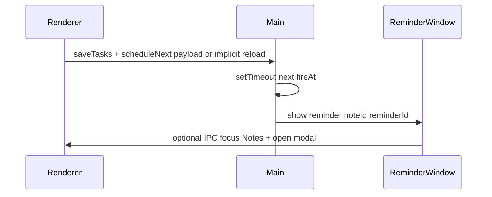

# Notes/Todo reminders and related product ideas

## Current baseline

- Notes live in profile JSON under `notes.items`; each item is shaped by [`normalizeNoteItem`](c:\Users\padma\OneDrive\Documents\Projects-Darwin\flow-assist\renderer.js) (`kind` `note` | `todo`, `id`, `title`, `body`/`checklist`, `createdAt`, `updatedAt`).
- Persistence is already [`save-tasks`](c:\Users\padma\OneDrive\Documents\Projects-Darwin\flow-assist\main.js) / load; new fields on note items round-trip automatically if normalized on load.
- Electron entry: single [`BrowserWindow`](c:\Users\padma\OneDrive\Documents\Projects-Darwin\flow-assist\main.js); [`preload.js`](c:\Users\padma\OneDrive\Documents\Projects-Darwin\flow-assist\preload.js) exposes `taskAPI` only—any new main-process behavior needs new `ipcMain.handle` + preload bridge methods.

## 1. Reminder feature (timers + date/time)

### Data model (recommended)

Attach reminders **per note item** (covers both free-form notes and todo lists):

```text
reminders: [
  {
    id: string,           // stable id for dismiss/snooze updates
    fireAt: string,       // ISO 8601 UTC instant when alarm should fire
    mode: 'absolute' | 'relative',  // how user set it (optional, for UI)
    label?: string,       // optional override; default to note title
    dismissedAt?: string,
    snoozedUntil?: string // if snoozed
  }
]
```

- **Absolute**: user picks local date/time → convert once to `fireAt` (store UTC ISO).
- **Relative (“in 25 min”)**: on **Save / Arm**, compute `fireAt = now + duration` and persist (same as absolute after computation). Optionally offer **“Start timer”** that only sets `fireAt` when clicked (if you want the countdown to start later, not at save time—product choice).

Normalize in `normalizeNoteItem`: default `reminders` to `[]`, validate `fireAt`, drop invalid entries.

### Scheduling (where the clock runs)

| Approach | Pros | Cons |
|----------|------|------|
| Renderer-only `setTimeout` | Simple | Missed if tab idle-throttled, fragile |
| **Main process poll / next-timeout** | Fires while app runs; one place to trigger UI | Still **no fire if app fully quit** unless you add OS-level scheduling |
| OS **Notification** API | Works when app in background (with permission) | Toast UX varies; “nice” UI may still need a custom window |

**Recommendation:** implement a **main-process reminder service**:

- On profile load and after each save, IPC sends the **sorted list of future `fireAt`** (or main reads from renderer via invoke passing minimal payload—avoid duplicating full profile in main if possible).
- Main keeps **one** `setTimeout` for the **next** due time (or a short interval check every ~30s if you prefer simplicity).
- When `now >= fireAt` (and not dismissed/snoozed): trigger **reminder surface** (below), then reschedule next.

This matches how your app already centralizes file IO in main and keeps renderer as UI.

### “Nice popup” when timer hits zero

Layered UX (you can ship in phases):

1. **Custom child `BrowserWindow`** (small, frameless or minimal chrome, loads `reminder.html` + small CSS) — best “designed” popup, draggable, on-top optional (`alwaysOnTop`).
2. **`dialog.showMessageBox`** — fast but generic; use only as fallback.
3. **`Notification`** (Electron or `new Notification` with permission) — good when window is minimized; **Supplement** with #1 when user wants rich UI.

Wire via new IPC, e.g. `reminder:show` from main → already-open renderer could listen, **or** main opens child window only—simplest is **main opens dedicated reminder window** with title + note id + actions (Open note / Snooze / Dismiss).

### UI in Notes (renderer)

- On each card (grid + modal): **Reminder** control (bell icon or “Remind…”).
- **Panel or popover**: tabs or segments — **“At date & time”** (`datetime-local` or separate date + time) and **“In …”** (number + unit: min/hr + presets: 5/15/30/60).
- List **upcoming** reminders on the card (next fire time, edit/remove).
- Optional: filter column “Has reminder” later (not required for v1).

### Edge cases

- **Timezone**: store UTC ISO; display in local time in UI.
- **Missed alarms** (app was closed): on next launch, detect `fireAt < now` and **either** show “missed reminder” toast/list **or** auto-snooze (product choice).
- **Duplicates**: one-off firing—after fire, mark reminder dismissed or remove it unless recurring (future feature).



### Files likely touched

- [`main.js`](c:\Users\padma\OneDrive\Documents\Projects-Darwin\flow-assist\main.js) — scheduler, optional `BrowserWindow` factory, `ipcMain` handlers.
- [`preload.js`](c:\Users\padma\OneDrive\Documents\Projects-Darwin\flow-assist\preload.js) — expose `scheduleReminders`, `onReminderDue`, etc.
- [`renderer.js`](c:\Users\padma\OneDrive\Documents\Projects-Darwin\flow-assist\renderer.js) — `normalizeNoteItem`, card HTML, wire controls, push schedule hints after save.
- [`index.html`](c:\Users\padma\OneDrive\Documents\Projects-Darwin\flow-assist\index.html) / new `reminder.html` — UI shell for popup if using separate window.
- [`styles.css`](c:\Users\padma\OneDrive\Documents\Projects-Darwin\flow-assist\styles.css) — reminder popover + popup styling.

### Complexity estimate

- **MVP** (relative + absolute, persist, main schedules while app open, custom popup window, dismiss/snooze): **medium** (touch main + renderer + one new HTML surface).
- **+ OS notifications + minimized behavior**: **medium+** (permissions, Windows Action Center quirks).
- **Firing when app is fully exited**: **high** (Windows Task Scheduler / startup shortcuts / separate helper)—out of scope unless you explicitly need it.

---

## 2. Extra features around reminders (same theme)

Short-term (high leverage, fits existing data):

- **Snooze presets** in the popup (5m / 15m / 1h) + **“Open in Notes”** jumping to that card/modal.
- **Tray icon badge** (“1 reminder due”) if you add a minimal `Tray` in main (optional).
- **Today / Upcoming strip** in Notes: sortable list of note titles with next `fireAt` (your “second brain” dashboard).
- **Link note ↔ task**: optional `linkedTaskId` on a note item—reminder shows task context and deep-link to task row (you already have task list navigation patterns in renderer).

Medium-term (habit + retention):

- **Daily digest modal**: “Notes with reminders in next 24h + overdue checklist items” (read-only summary).
- **Recurring reminders** (weekly standup): `rrule` or simple `repeat: weekly` + next `fireAt` regeneration after dismiss.
- **Pomodoro / focus session** tied to a note (“working on this”) — separate window or sidebar timer; **does not** replace reminder but pairs well.

Lightweight “second brain” (low coupling):

- **Quick capture**: global shortcut opens a small window → append new note with timestamp (requires `globalShortcut` in main).
- **Search notes** (title/body) in toolbar—pure renderer filter over `notes.items`.

---

## 3. Relax tab (break coach, timers, wellbeing tips)

### Purpose

A dedicated space for **focus/break rhythm** and **wellbeing nudges** (hydration, movement, eye breaks)—complementary to Notes-linked reminders: Relax is for **habit and recovery**, not task-owned deadlines.

### Navigation and branding

- Add a fifth primary view `relax` alongside existing [`data-view`](c:\Users\padma\OneDrive\Documents\Projects-Darwin\flow-assist\index.html) entries (`list`, `calendar`, `summary`, `notes`).
- **Sidebar**: new `<button class="nav-btn nav-btn--relax" data-view="relax">` with a **small sapling** icon (inline SVG, `currentColor` so CSS colors it).
- **Top bar “View” menu**: mirror the same entry for narrow layouts (pattern matches `.top-bar-view-screen` rows).
- **Panel**: `<div id="view-relax" class="view-panel">` with Relax-specific layout (toolbar + cards / sections).

**Green styling (your spec):**

- Default/inactive Relax nav: **icon + label use bright green** (`var(--accent-green-bright)` or a dedicated `--relax-nav-green`) so the tab reads as “wellness” even when not selected.
- **Active** Relax nav: **stronger emphasis** on the label (and optionally icon)—e.g. brighter/lighter green text, subtle background tint or soft glow—while **other** tabs keep existing `.nav-btn.active` blue behavior from [`styles.css`](c:\Users\padma\OneDrive\Documents\Projects-Darwin\flow-assist\styles.css) (`.nav-btn.active { color: var(--accent-blue); }`).
- Implementation: target `.nav-btn.nav-btn--relax` and `.nav-btn.nav-btn--relax.active` so only Relax overrides blue; avoid changing global active color for all tabs.

### Renderer wiring

- Extend [`setView`](c:\Users\padma\OneDrive\Documents\Projects-Darwin\flow-assist\renderer.js) / `updateTopBarViewButtonLabel` **labels** map to include `relax: 'Relax'`.
- Extend [`render()`](c:\Users\padma\OneDrive\Documents\Projects-Darwin\flow-assist\renderer.js): when `state.view === 'relax'`, call a focused `renderRelax()` (or no-op if purely static HTML + delegated listeners bound once).
- Respect existing Notes modal rule: closing behavior similar to `notes` if any Relax modal is added later.

### Relax tab content (MVP → richer)

1. **Timers**
   - **Break countdown**: presets (e.g. 5 / 10 / 15 min) + optional custom duration; clear Start / Pause / Reset.
   - **Optional “work block” timer** (e.g. 25 min) that suggests a break when done—same machinery, different copy.
   - **Eye-break 20-20-20** helper: optional small countdown or checklist (“look 20 ft away”)—can start as static tip + button.

2. **Wellbeing tips**

   - Rotating cards or a single **“Tip of the moment”** drawn from a small curated list: water, walk, stretch, eyes, breathing.
   - **Advance tip** on timer completion or manual “Next tip”.

3. **Persistence (optional for v1)**

   - Store preferences under `settings.relax` (e.g. default break length, sound on/off, tip categories)—follow existing `getSettings()` patterns in renderer.
   - Profile JSON already saves `settings`; no main.js change required unless you add OS notifications.

### Animations and polish — feasibility

| Approach | Effort | Fit |
|----------|--------|-----|
| **CSS** `@keyframes` (gentle sway on sapling SVG, fade/slide for tips, pulse on timer ring) | **Low** | Best first step; performant, themeable |
| **SVG SMIL / CSS transform** on sprout icon | **Low** | Good for “living” brand moment |
| **`requestAnimationFrame` + canvas** (particles, breath bubble) | **Medium** | More custom; watch CPU when tab in background |
| **Lottie / Rive** | **Medium+** | Adds dependency and asset pipeline; great motion if you invest |

**Verdict:** **Highly feasible** to ship a **calm, animated-feeling** Relax tab using **CSS + small SVG** first. Full “game-like” animation stacks are optional later.

### Challenges to expect

- **Timer accuracy when the tab is backgrounded**: browsers throttle `setInterval` / `setTimeout`; for **exact** break alarms while user works elsewhere in the app, prefer patterns aligned with the **main-process scheduler** (same family as note reminders) or accept ~1s drift in MVP for Relax-only countdown.
- **Sound**: optional chime needs **user gesture** or settings toggle; test on Windows volume/focus assist.
- **Scope creep**: Relax timers vs Notes reminders—**share IPC/notification plumbing** where possible, but keep **Relax UX separate** so wellbeing tools do not overload Notes data model.
- **Accessibility**: respect `prefers-reduced-motion`—disable or simplify sway/pulse animations when set.

### Synergy with note reminders

- Optional later: **“Send me to Relax tab”** when a break reminder fires from Notes—deep-link `setView('relax')` via IPC. Not required for Relax MVP.

---

## 4. Suggested implementation phases

**Reminders**

1. **Schema + UI to create/edit reminders**; persist; show upcoming time on card.
2. **Main scheduler + IPC**; fire → **custom reminder window** with title + Dismiss/Snooze/Open.
3. **Optional** `Notification` when window minimized + permission flow.
4. **Polish**: missed-on-launch handling, tray/badge (optional), digest strip.

**Relax (can parallelize after navigation shell)**

1. **Relax nav + view shell + green styling + sapling icon**; `setView` / top bar labels.
2. **Timer + tips UI** in `view-relax`; optional `settings.relax` persistence.
3. **CSS/SVG micro-animations** + `prefers-reduced-motion` handling.
4. **Optional**: align break alarms with main-process timing or OS notification.

This keeps the first milestone shippable without committing to OS-level alarms before you need them.
