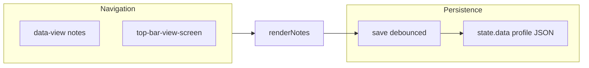

# Notes tab + sub-task status visibility

## Architecture

- **Views** today: [`index.html`](c:\Users\padma\OneDrive\Documents\Projects-Darwin\flow-assist\index.html) sidebar + `#top-bar-view-menu` use `data-view="list|calendar|summary"`; [`renderer.js`](c:\Users\padma\OneDrive\Documents\Projects-Darwin\flow-assist\renderer.js) `setView` / `render()` branch on `state.view` ([~6823–6828](c:\Users\padma\OneDrive\Documents\Projects-Darwin\flow-assist\renderer.js)).
- **Persistence**: `save()` calls `window.taskAPI.saveTasks(state.data)` ([~1542](c:\Users\padma\OneDrive\Documents\Projects-Darwin\flow-assist\renderer.js)). Any new domain data must live under **`state.data`** (same object written to disk).

---

## 1. Notes tab (Keep-like, simplistic)

**UI shell**

- Add **`#view-notes`** panel in [`index.html`](c:\Users\padma\OneDrive\Documents\Projects-Darwin\flow-assist\index.html) (same sibling pattern as `#view-list`, `#view-calendar`, `#view-summary`).
- Add **Notes** entry in:
  - Sidebar `.sidebar-nav` (`data-view="notes"`).
  - Top bar View dropdown `.top-bar-view-menu` (reuse `.top-bar-view-screen` pattern).
- Extend **`labels`** in `updateTopBarViewButtonLabel()` and **`render()`** switch to include `notes` → call new **`renderNotes()`**.

**Layout / UX**

- **Toolbar**: primary actions e.g. **New note** (scratch card) and **New todo list** (checklist card); optional minimal affordances only if needed (e.g. delete card).
- **Board**: CSS **grid** (responsive columns) of fixed-width cards with light shadow / rounded corners (Keep-inspired but minimal—no complex masonry unless trivial).
- **Card types**:
  - **Note**: title input (optional) + multi-line body (`textarea`), subtle optional accent (fixed palette or 3–4 soft border colors).
  - **Todo list**: title + list of rows (checkbox + text input); add-row control; support toggling done (strikethrough).

**Data model** (stored on profile root next to `tasks` / `settings`)

- Introduce e.g. **`state.data.notes`** with shape like:

  - `items: Array<{ id, kind: 'note' | 'todo', title, body, color?, checklist?: [{ id, text, done }], updatedAt }>`  

- **`setData()`**: default `notes` to `{ items: [] }` if missing; normalize checklist arrays.

**Auto-save (no Save button)**

- On **`input`** / **`change`** inside the Notes panel, schedule **`debouncedSaveNotes()`** (~400–500 ms) that updates `state.data.notes`, mutates `updatedAt`, then calls existing **`save()`**.
- Also **flush** on `blur` of focused fields and `document.visibilitychange` (hidden) so edits are not lost when switching apps.
- Avoid calling **`renderNotes()`** on every keystroke for the active card (otherwise focus jumps): prefer **updating `state.data` in handlers** and only re-render when adding/removing cards or structural checklist changes; for typing, bind handlers once after render or use event delegation on `#view-notes`.

---

## 2. Sub-task “View Type” (status filters)

**Placement**

- In **`renderTaskCard`**, extend the subtasks heading row ([~2868–2875](c:\Users\padma\OneDrive\Documents\Projects-Darwin\flow-assist\renderer.js)): beside existing **`subtask-filter-wrap`** (Sort), add **`subtask-viewtype-wrap`** with label **View Type** and the same dropdown pattern (`filter-dropdown-wrap` / `filter-dropdown-menu`).

**Filter semantics**

- Four buckets aligned with UI status buttons: **Open**, **Ongoing**, **Done**, **Dropped**.
- Implement **`canonicalSubtaskStatusLabel(s)`** mapping legacy values to buckets (`Completed` → Done, `Closed` → Dropped—mirror existing display logic around [`renderSubtaskCard`](c:\Users\padma\OneDrive\Documents\Projects-Darwin\flow-assist\renderer.js) ~2462).
- **Persistence**: store under **`state.data.settings.subtaskVisibilityByTaskId`** as `{ [taskId]: { Open: boolean, Ongoing: boolean, Done: boolean, Dropped: boolean } }`. Default **all `true`** when missing (show all).
- When rendering the `<ul class="subtask-list">`, **sort first** (`sortSubtasksForTask`), then **filter** by enabled buckets before **`map(renderSubtaskCard)`**.
- Dropdown menu: four **checkboxes**; changing any checkbox updates settings for that `taskId`, calls **`save()`**, then **`renderList()`** (same pattern as sort options in [`bindTaskCardEvents`](c:\Users\padma\OneDrive\Documents\Projects-Darwin\flow-assist\renderer.js) ~3953+).

**Edge cases**

- If all four unchecked, treat as **show none** (or optionally fallback to all—pick one and document in code comment; **show none** is least surprising).

---

## 3. Files to touch

| Area | File |
|------|------|
| Shell + nav | [`index.html`](c:\Users\padma\OneDrive\Documents\Projects-Darwin\flow-assist\index.html) |
| Styles | [`styles.css`](c:\Users\padma\OneDrive\Documents\Projects-Darwin\flow-assist\styles.css) — notes grid/cards, view-type dropdown spacing |
| Logic | [`renderer.js`](c:\Users\padma\OneDrive\Documents\Projects-Darwin\flow-assist\renderer.js) — `state.view`, `setView`, `render`, `setData`, notes module, sub-task filter + wiring |

No change required to Electron IPC unless save payload shape is validated elsewhere (grep `save-tasks` in [`main.js`](c:\Users\padma\OneDrive\Documents\Projects-Darwin\flow-assist\main.js)); profile is typically the whole JSON blob.

---

## 4. Testing checklist (manual)

- Switch between List / Calendar / Summary / **Notes** via sidebar and top bar; URL-less state should remain consistent with existing behavior.
- Notes: create note + todo list, type without clicking Save, kill delay / switch view / reload profile — content persists.
- Sub-tasks: toggle View Type checkboxes; only matching statuses appear; setting survives app restart (same profile).
