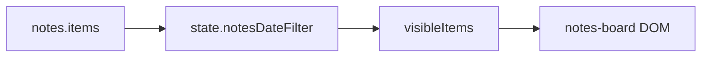

# Notes tab: created date, filter, checkbox, completed tint, green button

## 1. Data: `createdAt` on every note/todo

- **`normalizeNoteItem`** in [`renderer.js`](c:\Users\padma\OneDrive\Documents\Projects-Darwin\flow-assist\renderer.js): extend the returned object with `createdAt` (ISO string).
  - If `raw.createdAt` exists, keep it.
  - Else if legacy profile has only `updatedAt`, use that once so existing notes get a stable “created” anchor.
  - Else use `new Date().toISOString()`.
- **New items**: ensure paths that build items (`unshift` + `normalizeNoteItem({ kind: ... })`) pass through normalization so **new** notes/todos get **both** `createdAt` and `updatedAt` set to now (today `normalizeNoteItem` only sets `updatedAt` explicitly in return; add `createdAt` there).
- **Edits**: when syncing/editing, keep **`createdAt` unchanged**; continue updating **`updatedAt`** only where you already do (e.g. `syncNoteCardToModel`, checklist push).

No change required in [`main.js`](c:\Users\padma\OneDrive\Documents\Projects-Darwin\flow-assist\main.js) unless you add defaults to `getInitialTaskData` for consistency (optional).

## 2. UI: small “created” pill on cards

- In **`renderNoteCardHtml`**, compute a display label from `item.createdAt` (fallback `updatedAt`): e.g. **locale short date** or `YYYY-MM-DD` via `slice(0, 10)`.
- Render a compact element (e.g. `…`) on **both** grid cards and **modal** cards (same pill treatment), placed so it doesn’t fight the delete button—typical pattern: **top row** after title or **footer** of card; recommend **top-right area** under/alongside title row for consistency with Keep-like chips.
- Add styles in [`styles.css`](c:\Users\padma\OneDrive\Documents\Projects-Darwin\flow-assist\styles.css): pill (rounded, muted border/background, small type).

## 3. Toolbar: filter by day / month / range

- **State (in-memory only):** e.g. `state.notesDateFilter = { mode: 'all' } | { mode: 'day', date: 'YYYY-MM-DD' } | { mode: 'month', month: 'YYYY-MM' } | { mode: 'range', from: 'YYYY-MM-DD', to: 'YYYY-MM-DD' }`. No profile persistence unless you explicitly want it later.
- **HTML** in [`index.html`](c:\Users\padma\OneDrive\Documents\Projects-Darwin\flow-assist\index.html): add a **“Filter”** control in [`notes-toolbar-actions`](c:\Users\padma\OneDrive\Documents\Projects-Darwin\flow-assist\index.html) (or a second compact row under the toolbar to avoid crowding):
  - Mode: `<select>` or segmented control: All | Single day | Month | Range.
  - Inputs: `<input type="date">` for day; `<input type="month">` for month; two `<input type="date">` for from/to (shown based on mode).
  - **Apply** (or apply on change) + **Clear** to reset to `all`.
- **`renderNotes`**: derive `visibleItems = items.filter(noteMatchesDateFilter)` using **`createdAt` date part** (same fallback as display). Map only `visibleItems` to `renderNoteCardHtml`.
- **Wire** in `wireNotesToolbar` or a small `wireNotesFilterControls()` called from `render()` / `wireNotesToolbar`: listeners update `state.notesDateFilter`, call `renderNotes()` (no full `render()` if possible to avoid extra work).
- **Accessibility:** label associations and `aria-label` on the filter cluster.

Helper functions (same file): `getNoteCreatedDateKey(item) -> 'YYYY-MM-DD'`, `noteMatchesDateFilter(item, filter)`.

## 4. Checkboxes: more prominent

- In [`styles.css`](c:\Users\padma\OneDrive\Documents\Projects-Darwin\flow-assist\styles.css), update **`.notes-todo-done`** for grid + modal:
  - Increase **hit target** (`width`/`height` or `transform: scale`), adjust **`accent-color`** to **`var(--accent-green)`** or theme green to match success/completion.
  - Optionally **light border/background** on the checkbox via `appearance` + wrapper, or use a **custom** checkbox pattern (hidden native + styled span)—only if native resize isn’t enough; prefer minimal change first (size + accent + alignment `margin-top`).

## 5. Completed todo rows: light green tint

- Apply background on the **row** when checked:
  - CSS **`:has()`** (Electron/Chromium OK): e.g. `.notes-checklist-item:has(.notes-todo-done:checked)` with `background`, `border-radius`, subtle **green tint** using `rgba` + existing `--accent-green` / green tokens.
  - Mirror for **readonly** grid rows (checkbox + span structure) and **editable** modal rows (checkbox + input).
- Keep existing strikethrough/opacity rules; ensure contrast on dark theme.

## 6. “New list” button: green like “New note”

- In [`styles.css`](c:\Users\padma\OneDrive\Documents\Projects-Darwin\flow-assist\styles.css), change **`.notes-toolbar-btn--todo`** to use the **same green gradient / shadow** pattern as **`.notes-toolbar-btn--note`** (or a sibling variant if you want a slight distinction—user asked for green; matching the note button is the simplest).

## Verification

- Load a profile with existing notes: pills show dates; filter **All** shows everything.
- Set filter to **month** / **day** / **range**: only notes whose **`createdAt`** (date part) falls in range appear.
- Create a new note/todo: pill shows today; `createdAt` stable after edits.
- Toggle todo item: row picks up green tint; checkbox looks clearer.
- “New list” reads as green primary next to “New note”.
