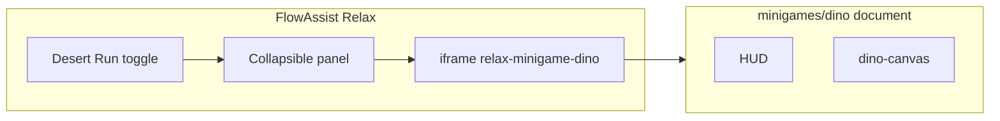

# Relax: Casual games section + collapsible Desert Run + canvas/layout tweaks

## Current behavior (baseline)

- Desert Run lives under **Wind down** beside wellbeing tips ([`index.html`](c:\Users\padma\OneDrive\Documents\Projects-Darwin\flow-assist\index.html) ~491–518).
- Inner game uses logical canvas **800×220** ([`minigames/dino/dino.js`](c:\Users\padma\OneDrive\Documents\Projects-Darwin\flow-assist\minigames\dino\dino.js) `W`/`H`; [`index.html`](c:\Users\padma\OneDrive\Documents\Projects-Darwin\flow-assist\minigames\dino\index.html) `canvas` attributes must stay in sync).
- **Full width is blocked** by [`minigames/dino/dino.css`](c:\Users\padma\OneDrive\Documents\Projects-Darwin\flow-assist\minigames\dino\dino.css) `.dino-root { max-width: 900px; margin: 0 auto; }`.
- **Speed ramp already exists**: `speed = Math.min(14, 5.5 + score * 0.0012)` in `update()` — no new mechanic required unless you want a **stronger** curve or higher cap (call out as a small numeric tweak).
- **Scrollbar**: Host uses `.relax-game-frame-wrap` with `aspect-ratio: 16 / 5` and `max-height: min(320px, 42vh)` ([`styles.css`](c:\Users\padma\OneDrive\Documents\Projects-Darwin\flow-assist\styles.css) ~6686–6696). The iframe is `height: 100%`. Inner doc uses `min-height: 100%` **plus** padding and HUD — content can exceed the iframe box height → iframe shows scrollbars. Inner `overflow` defaults also contribute.

## 1. Markup: “Casual games” section + toggle + collapsible panel

**File:** [`index.html`](c:\Users\padma\OneDrive\Documents\Projects-Darwin\flow-assist\index.html)

- After the **Timers** block (and before **Wind down**), add a new block:
  - Section label: **Casual games** (reuse `.relax-section-label`, new `id` for `aria-labelledby`).
  - A wrapper (e.g. `.relax-grid.relax-grid--casual` or a single full-width card) containing:
    - **Button** “Desert Run”: `id` like `relax-toggle-desert-run`, `aria-expanded`, `aria-controls` pointing at the panel below.
    - **Panel** (initially **collapsed**): `id` matching `aria-controls`, `hidden` attribute when collapsed (or class + `display:none` — prefer `hidden` for a11y).
    - Move the existing **iframe** + focus hint **into** this panel only (remove the game card from **Wind down** so Wind down is tips-only).

- Optional one-line hint under the button when collapsed: e.g. “Expand to play” (copy only).

## 2. Toggle behavior (expand / minimize)

**File:** [`renderer.js`](c:\Users\padma\OneDrive\Documents\Projects-Darwin\flow-assist\renderer.js) inside `wireRelaxTabOnce()` (after ~8740, alongside other Relax wiring).

- Click handler on `#relax-toggle-desert-run`:
  - Toggle panel visibility (`hidden` / remove `hidden`).
  - Flip `aria-expanded` (`true`/`false`).
  - Toggle button label if desired (e.g. “Desert Run” vs “Hide Desert Run”) — **must stay understandable**; simplest is keep label **“Desert Run”** and rely on `aria-expanded` + panel visibility (matches your “same button minimizes”).
- When **expanding**, optionally call `resize()` inside the iframe after load (postMessage is heavy); the mini-game already runs `resize()` on `window.resize` — triggering `window.dispatchEvent(new Event('resize'))` from parent does **not** cross iframe without `contentWindow`. Pragmatic approach: mini-game already handles resize on iframe resize; expanding the panel changes layout → iframe dimensions change → inner `resize()` runs if listeners fire. If needed, after toggle set `iframe.src` unchanged but reading `iframe.contentWindow` may fail on `file:` — prefer CSS so iframe gets explicit height without relying on cross-origin scripting (see §4).

## 3. Canvas: full width + slightly taller playfield

**Files:** [`minigames/dino/dino.css`](c:\Users\padma\OneDrive\Documents\Projects-Darwin\flow-assist\minigames\dino\dino.css), [`minigames/dino/dino.js`](c:\Users\padma\OneDrive\Documents\Projects-Darwin\flow-assist\minigames\dino\dino.js), [`minigames/dino/index.html`](c:\Users\padma\OneDrive\Documents\Projects-Darwin\flow-assist\minigames\dino\index.html)

- **Full width:** Remove or relax `.dino-root { max-width: 900px }` so the HUD + canvas span the iframe content width (`width: 100%`, no horizontal letterboxing from the root).
- **Taller:** Increase `H` (e.g. **220 → 280** or **300** — pick one concrete value in implementation). Recompute `groundY` (keep same ground band proportion or fixed pixel offset as today: `H - 48`).
- Sync **`canvas` `width`/`height` attributes** in `index.html` with `W`/`H` in `dino.js`.
- **Anti-scrollbar inside iframe:** Set `overflow: hidden` on `html, body` of the mini-game document (and ensure `.dino-root` does not force extra vertical overflow). Keep `#dino-canvas` `width: 100%`; existing `resize()` scales displayed size.

## 4. Host CSS: game frame height + no scrollbar

**File:** [`styles.css`](c:\Users\padma\OneDrive\Documents\Projects-Darwin\flow-assist\styles.css)

- **New** rules for Casual games layout (grid gap, optional card style for the toggle row).
- **Collapsible panel:** smooth height transition optional (simple show/hide first; CSS `transition` on max-height is fragile — ok to skip animation v1).
- **`.relax-game-frame-wrap`** (and `.relax-game-iframe`):
  - Replace or relax **`aspect-ratio: 16 / 5`** + tight **`max-height`** with sizing that fits the **taller** inner document: e.g. **`min-height`** driven by expected inner content (~HUD + scaled canvas + hints), or a slightly taller **`max-height`** (e.g. `min(440px, 55vh)`) so inner doc fits without scrolling.
  - Set **`overflow: hidden`** on the wrap and **`overflow: hidden`** on `iframe` via attribute `scrolling="no"` (legacy but effective in Electron) **and/or** host CSS `overflow: hidden` on the iframe element.
- Add **`relax-grid--casual`** if needed (single column, full width).

## 5. Difficulty: “faster over time”

**File:** [`minigames/dino/dino.js`](c:\Users\padma\OneDrive\Documents\Projects-Darwin\flow-assist\minigames\dino\dino.js)

- **Document** that ramp is already implemented; optionally **tune** `Math.min` cap (e.g. 14 → **16–18**) and/or coefficient (`score * 0.0012`) so progression feels clearer — keep changes minimal and playtestable.

## 6. Tests

**Files:** [`tests/regression/relax-dino.spec.js`](c:\Users\padma\OneDrive\Documents\Projects-Darwin\flow-assist\tests\regression\relax-dino.spec.js), [`tests/regression/relax-view.spec.js`](c:\Users\padma\OneDrive\Documents\Projects-Darwin\flow-assist\tests\regression\relax-view.spec.js)

- **Collapsed by default:** `#relax-minigame-dino` may be inside a **hidden** panel → **not visible** until expand. Update specs to **click `#relax-toggle-desert-run`** (or chosen id), assert **`aria-expanded`** / panel visible, **then** existing iframe/canvas steps.
- Adjust canvas click **y** position to roughly **half of new `H`** (e.g. 140 if `H=280`).
- **`relax-view.spec.js`:** Assert **Casual games** section exists (label + toggle), and iframe still has correct `src` after expanding (or assert toggle + panel structure without duplicating full game tests).

## 7. Verification

- Run `npm run test:regression`.
- Manually: Relax → Casual games → expand → full-width canvas, no iframe scrollbar, collapse restores minimized state.

## Scope boundaries

- No changes to Relax **timer** logic beyond wiring in `wireRelaxTabOnce`.
- Mini-game remains fully under `minigames/dino/` except Relax markup/CSS/renderer toggle.
