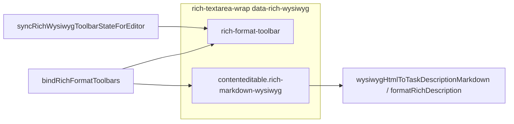

# Rich WYSIWYG + toolbar highlights for all formatted fields

## Scope (all toolbar-backed markdown fields today)

These all use [`renderRichFormatToolbarHtml()`](c:\Users\padma\OneDrive\Documents\Projects-Darwin\flow-assist\renderer.js) plus `formatRichDescription` for display; storage is markdown-like plain text.

| Surface | Location | Today |
|---------|----------|--------|
| Main task description (expanded) | [`renderTaskCard` ~4342](c:\Users\padma\OneDrive\Documents\Projects-Darwin\flow-assist\renderer.js) | WYSIWYG + sync (uses `data-task-desc-wysiwyg="1"`) |
| Add task description | [`index.html` ~253–263](c:\Users\padma\OneDrive\Documents\Projects-Darwin\flow-assist\index.html) + [`taskDescription.value` ~8886](c:\Users\padma\OneDrive\Documents\Projects-Darwin\flow-assist\renderer.js) | textarea |
| Subtask description | [`renderSubtaskCard` ~4056](c:\Users\padma\OneDrive\Documents\Projects-Darwin\flow-assist\renderer.js) + toggle ~5024 | textarea |
| New subtask description | ~4400 | textarea |
| Task progress “add” note | ~4350 | textarea |
| Subtask progress “add” note | ~4064 | textarea |
| Progress row inline edit | [`renderProgressItemLi` ~1163](c:\Users\padma\OneDrive\Documents\Projects-Darwin\flow-assist\renderer.js) + saves ~4565 / 4954 / 5193 | textarea |
| Log concern + resolve comment | [`renderConcernsBlock` ~3846–3865](c:\Users\padma\OneDrive\Documents\Projects-Darwin\flow-assist\renderer.js) | textarea |

## Architecture change

1. **Single opt-in flag** on the wrap: `data-rich-wysiwyg="1"` (replace `data-task-desc-wysiwyg` on the main task row so one code path covers everything).
2. **Single editor class** for binding, global `selectionchange`, and styling: `rich-markdown-wysiwyg` (keep existing layout classes alongside, e.g. `task-description-edit`, `subtask-desc-edit`, context-specific classes for progress/concerns so CSS can mirror current textarea rules).
3. **Rename/generalize helpers** in [`renderer.js`](c:\Users\padma\OneDrive\Documents\Projects-Darwin\flow-assist\renderer.js):
   - `setTaskMainDescriptionWysiwygFromMarkdown` → `setRichWysiwygFromMarkdown(el, md)` (same body: `formatRichDescription` + empty ` `).
   - `getTaskMainDescriptionEditorMarkdown` → `getRichWysiwygMarkdown(el)` (textarea branch removed once migrated, or kept briefly for safety).
4. **`bindRichFormatToolbars`**: detect `wrap.getAttribute('data-rich-wysiwyg') === '1'` and `wrap.querySelector('.rich-markdown-wysiwyg[contenteditable="true"]')`; reuse paste handler (rename `bindTaskMainDescriptionWysiwygPaste` → `bindRichMarkdownWysiwygPaste`); keep textarea path only if any wrap without the flag remains (goal: none).
5. **Global toolbar sync** ([~3705](c:\Users\padma\OneDrive\Documents\Projects-Darwin\flow-assist\renderer.js)): query `[data-rich-wysiwyg="1"] .rich-markdown-wysiwyg[contenteditable="true"]` instead of task-only selector.
6. **`syncRichWysiwygToolbarStateForEditor`**: `closest('.rich-textarea-wrap[data-rich-wysiwyg="1"]')`; treat editor as inactive not only when it has class `hidden`, but when **any ancestor** matching `.hidden` hides the edit UI (progress row edit lives under `.progress-item-edit.hidden` without putting `hidden` on the editor itself). Use something like `editor.closest('.hidden')` or `!editor.checkVisibility()` (Chromium in Electron) so toolbar highlights do not stick when the field is not visible.

## Markup per surface

- Each listed wrap: add `data-rich-wysiwyg="1"`, replace inner `<textarea …>` with a `div` / `role="textbox"` `contenteditable="true"` carrying `rich-markdown-wysiwyg` plus the same placeholder `data-placeholder` pattern used for the main task editor where applicable.
- **Subtask / main description**: mirror the main card pattern (view div + edit div, toggle saves `getRichWysiwygMarkdown`, opens `setRichWysiwygFromMarkdown`); subtask already has view/edit split like the task.
- **Progress add / progress edit / concerns / new subtask**: no view/edit split for the field itself—initialize innerHTML from `escapeHtml` is wrong for rich HTML; use `formatRichDescription(savedMd)` when populating, and empty ` ` when blank (same as main task).
- **`index.html`**: same structure as renderer-generated toolbars; ensure the add-task block still gets `bindRichFormatToolbars(document.getElementById('add-new-task-block'))` ([~8834](c:\Users\padma\OneDrive\Documents\Projects-Darwin\flow-assist\renderer.js)) and that submit/clear paths use `getRichWysiwygMarkdown` / `setRichWysiwygFromMarkdown` instead of `taskDescription.value`.

## CSS ([`styles.css`](c:\Users\padma\OneDrive\Documents\Projects-Darwin\flow-assist\styles.css))

- Extend rules under `.task-description-wysiwyg.task-description-edit` to also apply to `.rich-markdown-wysiwyg.task-description-edit` (and same for list/code blocks) so subtask + task stay visually identical.
- Add parallel rules for **progress** and **concern** contexts (group selectors with `.progress-text-in`, `.progress-item-edit .progress-edit-text`, `.concern-desc-in`, `.concern-update-comment` replacements targeting `.rich-markdown-wysiwyg` inside those parents) so min-height, flex, border, and focus match existing textarea styling (~[3110](c:\Users\padma\OneDrive\Documents\Projects-Darwin\flow-assist\styles.css), ~[5177](c:\Users\padma\OneDrive\Documents\Projects-Darwin\flow-assist\styles.css)).
- Update `:has(.task-description-edit.hidden)` hide rule for description rows if the editable node class string changes—target the wysiwyg class inside `.task-description-wrap` so the toolbar still hides in view mode.

## Code touchpoints (replace `.value` / textarea assumptions)

Systematically update every read/write found by grep for:

- `progress-edit-text`, `progress-text-in`, `subtask-progress-text`
- `concern-desc-in`, `concern-update-comment`
- `new-subtask-desc-in`, `subtask-desc-edit`
- `taskDescription` / `#task-description` add-task flow

Files: primarily [`renderer.js`](c:\Users\padma\OneDrive\Documents\Projects-Darwin\flow-assist\renderer.js), [`index.html`](c:\Users\padma\OneDrive\Documents\Projects-Darwin\flow-assist\index.html), [`styles.css`](c:\Users\padma\OneDrive\Documents\Projects-Darwin\flow-assist\styles.css).

## Testing (“aggressive”)

1. **Extend** [`tests/regression/task-description-wysiwyg.spec.js`](c:\Users\padma\OneDrive\Documents\Projects-Darwin\flow-assist\tests\regression\task-description-wysiwyg.spec.js) or add **`tests/regression/rich-markdown-wysiwyg-all-surfaces.spec.js`** with focused cases:
   - **Subtask description**: expand subtask → edit description → spaces + bold → save → view HTML contains bold; toolbar `aria-pressed` for bold when selection inside strong.
   - **New subtask**: open “New Sub-Task” panel → description WYSIWYG → bullet + plain text (whitespace regression).
   - **Task progress add**: type note with spaces, bold fragment, add progress → row view renders rich HTML; toolbar state after command.
   - **Progress inline edit**: open edit on an existing row (if E2E profile has progress) or add one then edit → change formatting → save → persists.
   - **Concerns**: log concern with formatted body; open resolve form, toolbar highlight on nested hidden parent (regression for visibility check).
   - **Add task** (index): fill title + description WYSIWYG, add task, assert task appears and description round-trip (read list card or re-open if needed).

2. **Corner cases** encoded in tests or assertions:
   - Whitespace not exploding to newlines on save (reuse pattern from existing space test).
   - Toolbar inactive when field hidden (progress cancel / toggle description view).
   - Two editors in DOM (e.g. expanded task + new subtask): bold only on the editor whose selection is active (global sync already iterates all; verify no cross-leak via `aria-pressed` on wrong card).

3. **Run** `npm run test:regression` to green; then stress runs locally: `npx playwright test tests/regression --repeat-each=5` (or `--retries=2` on CI) to flush ordering flakes; fix any timing with `expect.poll` / `toPass` where selection settles after `click`.

## Non-goals

- Changing the markdown dialect or `formatRichDescription` semantics (reuse existing serializer [`wysiwygHtmlToTaskDescriptionMarkdown`](c:\Users\padma\OneDrive\Documents\Projects-Darwin\flow-assist\renderer.js)).
- Substantial UI redesign beyond matching current textarea chrome.
