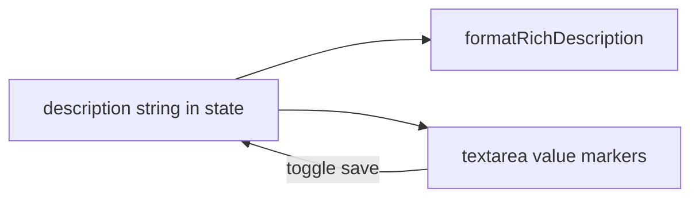

# WYSIWYG task description (expanded card only)

## Current behavior (baseline)

- Task `description` in data is a **plain string** using the app’s existing mini-markdown: `**bold**`, `*italic*`, `++underline++`, `` `code` ``, fenced ``` blocks, `- ` / `* ` bullets, `1. ` lists ([`formatRichDescription`](c:\Users\padma\OneDrive\Documents\Projects-Darwin\flow-assist\renderer.js) + [`applyRichToolbarCommand`](c:\Users\padma\OneDrive\Documents\Projects-Darwin\flow-assist\renderer.js)).
- In the **expanded task card**, edit mode uses a **`<textarea class="task-description-edit">`** with **raw markers**; view mode uses `.task-description-view` with rendered HTML.
- Toolbar is wired by [`bindRichFormatToolbars`](c:\Users\padma\OneDrive\Documents\Projects-Darwin\flow-assist\renderer.js) to insert markers into the adjacent textarea.



## Target behavior

- **Only** the main-task description editor in [`renderTaskCard`](c:\Users\padma\OneDrive\Documents\Projects-Darwin\flow-assist\renderer.js) (the block around lines 3961–3967): **no** `subtask-desc-edit`, **no** `#task-description` in [`index.html`](c:\Users\padma\OneDrive\Documents\Projects-Darwin\flow-assist\index.html), **no** concerns/progress/new-subtask textareas.
- While editing, the user sees **normal rich text** (bold/italic/underline/lists/code as rendered), not `**` / `*` tokens.
- **Persistence format unchanged**: still the same markdown-like string on `updateTask` / drafts so exports, summary, and `formatRichDescription` elsewhere keep working.

## Implementation approach

**Editor surface**: Replace the main-task `<textarea class="task-description-edit ...">` with a **`<div role="textbox" contenteditable="true" ...>`** (keep `task-description-edit` for layout hooks; add a dedicated class e.g. `task-description-wysiwyg` and `data-task-desc-wysiwyg="1"` on the wrapping `.rich-textarea-wrap` so toolbar logic can branch).

**Markdown → editor (on open / render while `descEditing`)**  
- Set `innerHTML` from existing [`formatRichDescription(descRaw)`](c:\Users\padma\OneDrive\Documents\Projects-Darwin\flow-assist\renderer.js) (empty string → a single `<br>` or empty `<p>` so the caret works).

**Editor → markdown (on toggle-save, draft capture, `save-task-details-btn` if it ever reads description)**  
- Implement **`wysiwygHtmlToTaskDescriptionMarkdown(root)`** in [`renderer.js`](c:\Users\padma\OneDrive\Documents\Projects-Darwin\flow-assist\renderer.js): walk the editor’s DOM and emit the same dialect the app already parses (`**` / `*` / `++` / backticks / fences / `- ` lines / `1. ` lines). Map browser tags from `document.execCommand` (`<b>`, `<strong>`, `<i>`, `<em>`, `<u>`, `<ul>`, `<ol>`, `<li>`, `<br>`, `<div>`, `<pre>`, `<code>`, `<a>`) to that format. No new npm dependency (renderer is plain script; [`package.json`](c:\Users\padma\OneDrive\Documents\Projects-Darwin\flow-assist\package.json) has no bundler).

**Toolbar**  
- Extend [`bindRichFormatToolbars`](c:\Users\padma\OneDrive\Documents\Projects-Darwin\flow-assist\renderer.js) / [`applyRichToolbarCommand`](c:\Users\padma\OneDrive\Documents\Projects-Darwin\flow-assist\renderer.js): when the wrap has `data-task-desc-wysiwyg="1"` and the target is contenteditable, **`focus` the editor** and use **`document.execCommand`** (`bold`, `italic`, `underline`, `insertUnorderedList`, `insertOrderedList`, and keep code / codeblock behavior via `insertHTML` of fenced blocks or minimal wrapper nodes that the serializer understands). Update button `title` attributes to plain-language (no “**text**” in tooltips) for this wrap only if trivial.

**Event wiring** (same file as today)  
- [`toggle-desc-edit` handler](c:\Users\padma\OneDrive\Documents\Projects-Darwin\flow-assist\renderer.js) (~4390–4412): on **enter** edit → populate WYSIWYG from markdown; on **leave** (check) → `wysiwygHtmlToTaskDescriptionMarkdown` then `updateTask(..., { description })` then refresh view HTML as today.
- [`captureTaskListEditorDrafts`](c:\Users\padma\OneDrive\Documents\Projects-Darwin\flow-assist\renderer.js) (~5261–5264): read markdown from the contenteditable via the serializer instead of `.value`.
- Grep for any other `descEdit.value` / `querySelector('...task-description-edit:not(.subtask-desc-edit)')` and branch on `contentEditable` or tag name.

**Paste / safety**  
- `paste` listener on the editor: **`preventDefault`**, insert **`text/plain`** only (or strip HTML to text) to avoid pasting arbitrary HTML that breaks the serializer.

**CSS** ([`styles.css`](c:\Users\padma\OneDrive\Documents\Projects-Darwin\flow-assist\styles.css))  
- Reuse `.task-description-view` visual language for **`[contenteditable].task-description-edit`**: same padding, border, font, min-height, `white-space`/list styles as the rendered view (reuse `.rich-ul` / `.rich-ol` / `.rich-li` where possible inside the editor).

## Testing

- Add [`tests/regression/task-description-wysiwyg.spec.js`](c:\Users\padma\OneDrive\Documents\Projects-Darwin\flow-assist\tests\regression\task-description-wysiwyg.spec.js) using existing helpers ([`electron-app.js`](c:\Users\padma\OneDrive\Documents\Projects-Darwin\flow-assist\tests\helpers\electron-app.js), [`copyProfileForMutation`](c:\Users\padma\OneDrive\Documents\Projects-Darwin\flow-assist\tests\helpers\profile-copy.js), [`waitForProfileLoaded`](c:\Users\padma\OneDrive\Documents\Projects-Darwin\flow-assist\tests\helpers\wait-for-app.js)).
- Flow: list view → click **`.task-bar`** on first task to **expand** → click **`.toggle-desc-edit`** → type a distinctive word → select it (triple-click or `fill` + keyboard) → click toolbar **Bold** → assert **visible editor text does not contain `**`** and **DOM contains `strong` or `b`** wrapping the word → toggle save → assert **`.task-description-view`** still shows bold (e.g. `locator('strong')` with that text). Optional second case: **bullet** toolbar → `ul`/`li` in editor, then save and assert list structure in view.
- Run: `npm run test:regression -- tests/regression/task-description-wysiwyg.spec.js` (or full regression if you prefer parity with CI).

## Risks and mitigations

- **Round-trip fidelity**: serializer + `execCommand` may drift from [`formatRichDescription`](c:\Users\padma\OneDrive\Documents\Projects-Darwin\flow-assist\renderer.js); mitigate with the Playwright cases above plus a **`page.evaluate`** round-trip check on simple strings (`**a**`, list lines) during development.
- **`execCommand` deprecated**: still reliable in Electron/Chromium; acceptable for this scoped feature until a later full-editor migration.

## Out of scope (explicit)

- Add-task `#task-description`, subtask descriptions, progress, concerns, notes (per your rollout plan).
