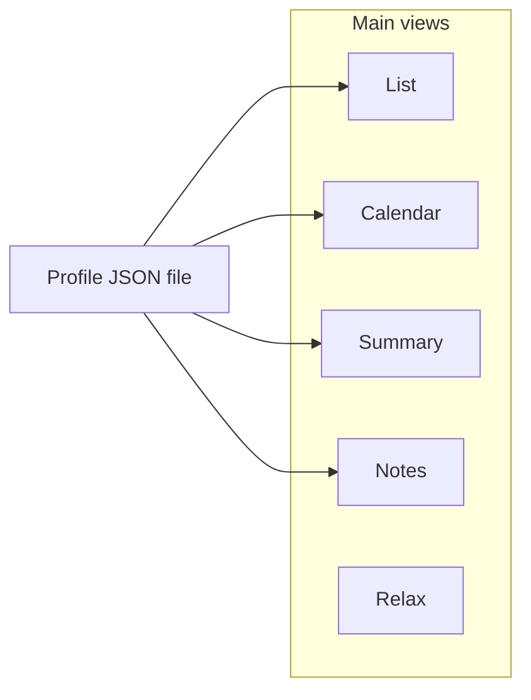

# FlowAssist

> A **desktop task tracker** for people who want their work plan, progress history, and reports in one place—**stored in files you control**, not in someone else’s cloud.

FlowAssist is **free software** released under the [**GNU General Public License v3.0** (GPLv3)](LICENSE). You may run, study, redistribute, and modify it under that license; the full legal text is in the [`LICENSE`](LICENSE) file in this repository.

FlowAssist is built for **individual contributors and small teams** who track real work: priorities, ETAs, time logged, sub-tasks, and “what changed over time.” Use it for **weekly planning**, **sprint-style visibility**, **status reviews**, and **lightweight reporting**—plus **scratch notes**, **checklist todos**, **reminders**, and a **Relax** space for breaks—without leaving a local JSON profile behind.

---

## Table of contents

- [At a glance](#at-a-glance)
- [Quick start: where everything lives](#quick-start-where-everything-lives)
- [List and tasks](#list-and-tasks)
- [Calendar](#calendar)
- [Summary and export](#summary-and-export)
- [Notes](#notes)
- [Relax](#relax)
- [Profiles and storage](#profiles-and-storage)
- [Settings](#settings)
- [Application shell](#application-shell)
- [Stack](#stack)
- [Development (Windows)](#development-windows)
- [Building Windows executables](#building-windows-executables)
- [Data and schema](#data-and-schema)
- [License](#license)

---

## At a glance

| You want to… | FlowAssist helps by… |
|----------------|----------------------|
| **Own your data** | Everything lives in a **JSON profile** (`.fa.json`). No account, no server. |
| **Separate work streams** | **Load / create profiles** for different roles, clients, or quarters. |
| **See work at a glance** | **List**, **Calendar**, and **Summary** over the same task model; **Notes** for boards and todos; **Relax** for timers and wellbeing nudges. |
| **Track effort honestly** | **Progress updates** with hours, **planned vs. actual** effort history, **day offs** in bandwidth math, and **no-effort** options where tracking should not apply. |
| **Break work down** | **Sub-tasks** with their own status, ETA, progress, filters, and optional roll-up into parent totals. |
| **Surface risk** | **Concerns** on tasks and sub-tasks, with an “addressed” trail. |
| **Share or archive** | **Export summaries** as **HTML/CSS** (full or brief) or **Confluence Markdown** for email, wikis, or tickets. |

---

## Quick start: where everything lives

Use the **sidebar** (or the **View** menu on smaller layouts) to switch screens. Each view is a different lens on the same profile file.

| View | What you do here |
|------|------------------|
| **List** | Main task board: add tasks, expand cards, sub-tasks, progress, concerns, rich descriptions, sorting and filters. |
| **Calendar** | Day / week / month, go-to-date, basic or Gantt-style chart, assigned vs ETA filter, **day off** logging and history. |
| **Summary** | Pick a date range, generate planned vs actual and bandwidth, then export. |
| **Notes** | Keep-style **notes** and **todo lists** on a board; optional **reminders** per card; auto-saved into the profile. |
| **Relax** | Break and focus timers, rotating wellbeing tips—separate from task-owned deadlines. |

**Settings** (gear) holds working hours, categories, projects, priority colors, and theme. **File** handles profiles (open, new, save as). **Help → Documentation** opens the first file that exists, in this order: **`DOCUMENTATION.md`**, **`README.md`**, **`docs/index.html`** (next to the app). In this repository, **`README.md`** is present so it opens unless you add `DOCUMENTATION.md`.



---

## List and tasks

### Main list

- **Add tasks** with title, description, **project** (from settings), **multi-select categories**, **priority (1–10)**, **difficulty**, **tags**, **assigned date**, **ETA**, **effort (hours)**, and **bug IDs** (including comma-separated lists).
- **Sort** main tasks by date added, priority, or ETA (ascending/descending).
- **Status workflow**: Open, Ongoing, Completed/Done, **Dropped**, and controls for moving work through its lifecycle.
- **Visual priority**: Task bars use **per-priority colors** from **Settings**; sub-tasks use a darker tint.
- **Progress updates**: Log dated notes with **hours consumed**; totals feed **summary bandwidth** and calendar logic.
- **History**: **ETA updates** and **effort (plan) updates** keep a dated trail when plans change.
- **Concerns**: Flag issues on a task; **address** them with a date and comment; open vs addressed state is visible in the UI.
- **Exclude from summary/export**: Optional flags on tasks (and sub-tasks) when something should not appear in generated reports.
- **Done section**: Completed work is listed separately for a cleaner active list.

### Rich text (descriptions, progress, concerns, add-task)

Long text fields use the same **mini-markdown** style everywhere it matters: bold, italic, underline, inline code, fenced code blocks, and bullet/numbered lists. You edit in a **WYSIWYG** surface with a **formatting toolbar**; the file still stores a **markdown-like string** so exports and summaries stay consistent. **Paste** from rich apps is normalized to **plain text** so formatting stays predictable.

### Drafts and unsaved edits

If you type in an expanded **task**, **sub-task**, or **new sub-task** composer and have not saved yet, that content is kept as a **draft** when you **collapse** the card, **change list filters**, or **switch to another view** (Calendar, Summary, Notes, Relax). Drafts clear when you **save** the relevant details or remove the task.

Drafts and which **panels** were open (details vs other sections) are also written to **browser local storage** keyed by the **active profile path**, so they can survive an **app restart** until you save or discard—handy if the app closes unexpectedly.

### Sub-tasks

- Nested under a main task with their own fields (title, description, status, priority, dates, **ETA**, categories, project, difficulty, progress updates, concerns).
- **View Type** (beside sub-task **Sort**): checkboxes for **Open**, **Ongoing**, **Done**, and **Dropped**—only sub-tasks in checked buckets are shown. The choice is saved **per main task** in your profile. If all four are unchecked, the list shows **none** (by design).
- **Effort roll-up**: If a sub-task has **no dedicated planned effort**, its logged hours can **roll up** into the parent for summary math; dedicated effort is tracked separately when set.
- **No effort needed** on a sub-task persists and is honored in roll-up and ribbon logic. On the **main** task, when **No effort needed** is on, the **Effort** chip shows scope text such as **`(Only Main Task)`** vs **`(All)`** depending on whether every sub-task is also marked no-effort; **Effort spent** on the ribbon can reflect **sub-task work** when the parent is exempt from logging hours on itself.
- Sub-task ribbons can show **Effort spent** alongside other meta chips, similar to the main task row.

---

## Calendar

- **Views**: Day, week, and month navigation with **go-to-date**.
- **Chart styles**: **Basic** and **Gantt-style** layouts.
- **Filter**: Show tasks by **assigned (date added)** vs. **ETA (due date)**.
- **Day offs**: Log **full or partial** PTO / sick / other; hours respect **working hours per day** from Settings for utilization-style summaries.
- **Day off list** (in the Calendar view): **scrollable** list of entries, **All / Month / Year** browsing with **previous/next** when in month or year mode, and a **short weekday** on each line (e.g. `Mon · 2026-05-07 · …`). This browser only changes **what you see in the list**; **Summary** bandwidth and OOO math still use the **summary date range** you pick on the Summary screen, not the list’s browse mode.

---

## Summary and export

- Pick a **date range**, then **Generate Summary** for planned vs actual effort, bandwidth utilization (using working hours and day offs), and task/sub-task tables with sensible date filtering (for example hiding items finished before the range when appropriate).
- **Export** the generated summary as **HTML/CSS** or **Confluence Markdown**. Export respects **exclude from summary/export** flags where implemented.
- In **bandwidth** strings and **OOO** detail lines (on screen and in HTML export), dates are shown with a **weekday** where applicable, aligned with the Calendar day-off list.

After **Export Summary** with **HTML/CSS** selected, the UI offers two tabs:

- **Full Summary** — complete document plus separated **HTML** / **CSS** fields (for pasting into HTML macros and stylesheets). Work tables include **Remaining Effort** and **Task Details** where applicable.
- **Brief Summary** — same structure and data, but work tables **omit** the **Remaining Effort** and **Task Details** columns for a shorter stakeholder view.

#### Confluence Markdown export

- Vertical layout with an **Effort/ETA** block: two markdown tables stacked under one heading.
- Confluence Cloud markdown has no text color — **bold** marks changed steps and over-plan remaining; use the editor’s **Text color** after paste if you want color.
- Tasks with no progress in range **omit the Progress block** in markdown; concerns are still listed under **Concerns**.

<details>
<summary><strong>Export layout (HTML/CSS)</strong> — section structure and column behavior</summary>

The exported document is structured with horizontal rules and subheadings:

- **Work Summary** title and date range, then the **Bandwidth** table (project/miscellaneous utilization and an **OOO** total in day-equivalents at your working-hours-per-day setting).
- **OOO details** — under the bandwidth table, when any **day offs** fall in the selected range, a short list of each entry with **date** (DD-MM-YYYY), **weekday**, **reason** (PTO / Sick / Other), and **full day** vs **partial hours off**.
- **Task Updates** — heading and rule above the main table for tasks **with progress in the range**.
- **Tasks with No Progress** — separate section (heading + rule) for tasks with no in-range progress; the progress column shows **concerns only** (no “Progress: No progress made.” line). If there are no concerns, it shows **Concerns: None** (with **Concerns** in bold). If there are concerns, they are listed as in the full table.

Layout details: **Effort** and **ETA** column widths are sized from header labels and cell content; the **Effort** block in the no-progress table matches the **total width** of the Effort columns in the progress table so sections align visually.

</details>

---

## Notes

The **Notes** view is a simple board for **scratch notes** and **checklist todo** cards (similar in spirit to Google Keep, but minimal). Content lives in your **profile JSON** (alongside `tasks` and `settings`); there is no separate Save button for notes—changes are **debounced** to disk and **flushed** when you leave a field or hide the window.

### Board and focus modal

- **Toolbar**: **New note**, **New todo list**, and a **session-only filter** by created date (**All**, single **day**, **month**, or **date range**). Filtering does not change the file until you edit; it only hides cards on the board for this session.
- Each card shows a small **created** date pill.
- **Grid cards** are a **read-only preview**: you see title, body, and todo lines, and you can **check/uncheck** todo items from the board. To **edit text**, add checklist lines, or manage **reminders**, **click** the card (background or text—not the checkbox) to open the **focus modal**. Long todo lists show up to **five** lines on the board with a hint to open the modal for the rest; adding a sixth item from the board opens the modal automatically.

### Reminders

- Each note or todo card can have **reminders**: pick **a date and time**, or **in N minutes/hours** (preset-style relative scheduling).
- When a reminder fires **while the app is running**, you get the reminder UI (**dismiss**, **snooze**, **open in Notes**). The app can also use **system notifications** when appropriate (for example if the window is minimized)—behavior depends on OS permissions.
- **Important**: reminders are scheduled **inside the running app**. They do **not** wake the machine or fire if FlowAssist is **fully quit** unless you add external tooling later.

In the modal, the reminder area stays **compact** until you have at least one scheduled reminder; then a **Reminder** heading and list row appear.

---

## Relax

**Relax** is a separate view for **focus and recovery**: short **break** (and optional **work block**) timers, simple controls (start/pause/reset), and **wellbeing tips** (hydration, movement, eyes, and similar). The sidebar uses a **green** accent for this tab so it reads as wellbeing, distinct from task navigation. Relax does not replace **Notes** reminders; it complements them for habits between tasks.

---

## Profiles and storage

- **Default data file** (dev): `tasks.json` next to the project, or (installed app) under your OS **user data** folder.
- **Named profiles**: **File → Load Profile…** (`Ctrl+O`), **New Profile…**, **Save As…** (`Ctrl+Shift+S`). New files are normalized to a **`.fa.json`** name when you save.
- **Preferences** (e.g. which profile is active) are stored separately as `flowassist-profile.json` in app user data—your task JSON stays portable.

---

## Settings

- **Working hours per day** (drives bandwidth, summary, and partial day-off behavior).
- **Category types** and **project names** (comma-separated lists used across the UI).
- **Priority bar colors** for priorities 1–10.
- **Theme** preference (stored locally in the browser profile for the Electron window).

---

## Application shell

- **Menu**: **File** (profiles, save as), **View** (reload), **Help** (**Documentation** tries `DOCUMENTATION.md`, then `README.md`, then `docs/index.html`; **About**).
- **Sidebar**: **List**, **Calendar**, **Summary**, **Notes**, **Relax**; **Settings** button; **version and author** line under Settings (from `package.json`).
- **Security model**: **Context isolation** and **preload bridge** (`taskAPI`) for IPC—the renderer does not get raw Node APIs.

### Developer / debug

- `npm run start:debug` launches with **`--flowassist-debug`** (DevTools + debug flag for the renderer).

---

## Stack

- **Electron** (desktop shell)
- **HTML / CSS / vanilla JavaScript** (no React/Vue in the renderer)
- **JSON** on disk for all task data

---

## Development (Windows)

### Prerequisites

- **[Node.js](https://nodejs.org/)** LTS or Current (includes `npm`)
- **Git** (optional, if you clone from a repository)

### Clone and install

```powershell
git clone https://github.com/PXVI/flow-assist.git
cd flow-assist
npm install
```

If `npm install` fails with **EBUSY** / file-lock errors on `electron` under **OneDrive**, try pausing sync for the folder, closing other apps using the project, or cloning to a path outside OneDrive (for example `%TEMP%` or `C:\dev\flow-assist`) and working there.

### Run the app

```powershell
npm start
```

Optional debug run (DevTools + `window.__FLOWASSIST_DEBUG__`):

```powershell
npm run start:debug
```

---

## Building Windows executables

From the project root, after `npm install`:

```powershell
npm run dist
```

This uses **electron-builder** and writes output under **`dist\`**.

Typical artifacts:

| Artifact | Role |
|----------|------|
| **`FlowAssist-Portable.exe`** | Self-contained portable build—run without running an installer. |
| **`FlowAssist-Setup-<version>.exe`** | NSIS installer (choose install directory, not one-click). |

The **`dist\`** folder is **gitignored**; ship binaries via **GitHub Releases** (or similar), not by committing them to the repo.

### If the build fails on Windows

- **`CSC_IDENTITY_AUTO_DISCOVERY=false`** before `npm run dist` can help when tooling tries to use signing-related caches that need symlink privileges. The project is configured with **`signAndEditExecutable: false`** for simpler unsigned builds.
- Installers are **not code-signed** by default; Windows SmartScreen may warn until you sign with your own certificate.

### Unpacked folder (optional)

To inspect the app folder without making installers:

```powershell
npm run pack
```

---

## Data and schema

Task shape and helpers are described in **`data-schema.js`** (JSDoc and exports). The live app stores a top-level object with **`tasks`** and **`settings`**; the **Notes** feature adds a **`notes`** object (for example `notes.items`) when you use that tab. Treat profiles as **your documents**: back them up, diff them, and version them in Git if you want.

---

## License

**GNU General Public License v3.0** — see [`LICENSE`](LICENSE).

In short (this is not a substitute for the license text): GPLv3 is a **copyleft** license. If you **distribute** this program or a modified version, you must generally **license the distributed work under GPLv3** and **provide corresponding source** (or a written offer, as the license specifies). Using the app privately or modifying it for your own use without distributing it does not trigger those distribution obligations.

- **Your task data** (JSON profiles you create) is **yours**; the license governs the FlowAssist **program**, not the content of your files.
- **Copyright**: see `author` in [`package.json`](package.json); you may add a copyright notice in source files as you prefer.

For the authoritative terms, always read **`LICENSE`**.

**SPDX identifier:** `GPL-3.0` (listed in `package.json` as `"license": "GPL-3.0"`).
